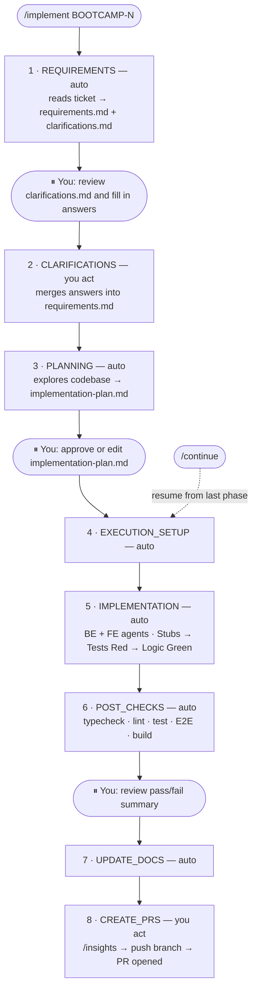

# Participant Workflow Guide

Step-by-step guide: from starting an exercise to raising a pull request using Claude Code.



---

## What you're learning

This boot camp teaches the **AI-SDLC workflow** — a structured approach that replaces informal development habits with verifiable, repeatable steps.

| Traditional flow | AI-SDLC flow | Why it matters |
|-----------------|--------------|----------------|
| Developer reads ticket and fills in gaps from memory | `/requirements` extracts requirements and surfaces clarifications | Ambiguity becomes visible and resolved before a line of code is written |
| Design intent lives in someone's head or Slack | Feature brief and architecture plan are read before planning | Claude aligns the plan with actual design intent, not a guess |
| Implementation plan lives in chat or gets skipped | `/plan` writes a reviewed, file-level plan before any code runs | BE, FE, and tests proceed with shared expectations |
| Tests are written after (or instead of) logic | Agents follow TDD: stubs → failing tests → logic to make them pass | Acceptance criteria become executable checks, not post-hoc verification |
| Verification depends on local habit and discipline | `/post-checks` runs every check command before the branch is pushed | "Done" is tied to fresh evidence, not developer confidence |
| PR descriptions written from scratch or skipped | `/create-prs` produces PRs with requirements, plan, and session insights | Reviewers get full context by default; sessions are debriefed automatically |

---

## Prerequisites

Before running any exercise, confirm:

1. App is bootstrapped and running:
   ```bash
   ./scripts/bootstrap.sh   # first time only
   npm run dev
   ```
2. Claude Code is open in the `boot-camp-starter` directory.
3. Playwright browsers are installed:
   ```bash
   npx playwright install chromium
   ```
4. `gh` CLI is authenticated:
   ```bash
   gh auth status   # should show "Logged in to github.com"
   ```

---

## Exercises with parent tickets (03, 04, 05)

Exercises 03, 04, and 05 each have a parent ticket and capability sub-tickets. Run the parent ticket first to create the **Foundation Skeleton PR**, then branch capability sub-tickets from it.

| Step | Command | What happens |
|---|---|---|
| 1 | `/implement BOOTCAMP-3` | Skeleton PR opened → `solutions/03-admin-pages` |
| 2 | Create capability branches from the skeleton branch | (see git-worktrees.md for Exercise 03) |
| 3 | `/implement BOOTCAMP-3-1` (and 3-2, 3-3) | Capability PRs opened → `participant/<name>/03-admin-pages` |

Capability PRs target the **parent exercise branch**, not the solutions branch. The final merge is the skeleton PR rolling everything up into solutions.

For Exercises 01 and 02 (single tickets), skip directly to Step 1 below.

---

## Step 1 — Start from the right base

Your branch is created automatically by `/implement` — no manual `git checkout -b` needed.

All you need to do is start from the correct base commit before running `/implement`:

**Exercises 01, 02 and 07:**
```bash
git checkout claude-harness-v1.0.1
# Then run /implement BOOTCAMP-1 (or 2)
# → branch participant/<your-git-name>/01-cancel-booking is created automatically
```

**Exercises 03, 04, 05 and 06:**
```bash
git checkout claude-harness-v1.0.1
# Then run /implement BOOTCAMP-3 (or 4, 5)
# → skeleton branch participant/<your-git-name>/03-admin-pages is created automatically
# → after skeleton PR is pushed, worktrees for sub-tickets are also auto-created
```

The branch name is derived from your `git config user.name` (slugified) and the exercise number. For Exercise 03 sub-tickets, you will already be in a worktree on the correct branch when the skeleton flow completes — just run `/implement BOOTCAMP-3-1` (etc.) from there.

See [`docs/boot-camp/git-worktrees.md`](../git-worktrees.md) for the full worktree setup for Exercise 03's three parallel capability branches.

---

## Step 2 — Read the exercise brief

Each exercise has three docs. Read them in order before running `/implement`:

```bash
# Replace NN-exercise-name with the actual folder, e.g. 01-cancel-booking
cat docs/boot-camp/exercises/NN-exercise-name/01-feature-brief.md
cat docs/boot-camp/exercises/NN-exercise-name/03-architecture-plan.md
cat docs/boot-camp/exercises/NN-exercise-name/04-scoping-doc.md
```

| File | What it contains |
|------|-----------------|
| `01-feature-brief.md` | User story, acceptance criteria, edge cases |
| `03-architecture-plan.md` | Which layers to touch and how they connect |
| `04-scoping-doc.md` | Task breakdown — the same ticket Claude will read |

---

## Step 3 — Run `/implement`

In the Claude Code prompt, type:

```
/implement BOOTCAMP-N
```

Replace `N` with the exercise number (e.g. `/implement BOOTCAMP-1`).

Claude will drive the workflow through eight phases. You will be asked to act at three of them — everything else runs automatically.

---

## The eight phases

### Phase 1 — REQUIREMENTS *(auto)*

Claude reads the Linear ticket and generates two files in `docs/execution/BOOTCAMP-N-*/`:

- `requirements.md` — what needs to be built
- `clarifications.md` — open questions before planning can start

**Claude stops here.** It tells you to review `clarifications.md`.

---

### Phase 2 — CLARIFICATIONS *(you act)*

Open `docs/execution/BOOTCAMP-N-*/clarifications.md`. You will see questions like:

```markdown
## Q1 — Should cancellation be allowed on past bookings?
**Answer**: <!-- fill in here -->
```

Fill in every answer directly in the file, then run:

```
/implement BOOTCAMP-N
```

Claude merges your answers into `requirements.md` and advances to planning. If your answers revealed new questions, it will stop again — repeat until all questions are `RESOLVED`.

> **Tip**: If the file is empty or all statuses are already `RESOLVED`, Claude skips this phase automatically.

---

### Phase 3 — PLANNING *(auto then you act)*

Claude explores the codebase and produces `implementation-plan.md` — a sequenced task list showing exactly which files will be created or modified, in which order.

**Claude stops here** and presents the plan for your review.

Read through `docs/execution/BOOTCAMP-N-*/implementation-plan.md`. You can edit it directly before approving. When you are satisfied, tell Claude to proceed. It will ask:

- **"Yes, proceed with implementation"** — go ahead as-is
- **"I've made edits — re-read the plan and proceed"** — if you edited the file
- **"No, I need more time"** — keep it paused

> **This is the gate.** No code is written until you approve the plan.

---

### Phase 4 — EXECUTION_SETUP *(auto)*

Claude sets up the execution tracking checklist. No input needed.

---

### Phase 5 — IMPLEMENTATION *(auto)*

Claude spawns sub-agents to implement each task from the plan:

- `backend-implementer` — writes routes, services, repositories, shared types, migrations
- `frontend-implementer` — writes components, hooks, API client functions

Each agent:
1. Reads the relevant `CLAUDE.md` for patterns
2. Implements the task
3. Runs `typecheck` + `lint` after each file
4. Commits with the format `BOOTCAMP-N: description`

> **Build your rules as you go:** When you correct Claude on the same mistake twice — wrong layer, wrong pattern, wrong naming — don't just fix it in conversation. Write it as a rule in `.claude/rules/`. Rules auto-load on future edits and prevent the same correction from recurring in the next exercise.

This is the longest phase. You will see progress in the Claude Code output. You do not need to intervene unless an agent reports a failure.

> **Exercise 03 — Parallel sessions (worktrees required):** Once the BOOTCAMP-3 skeleton PR is pushed, sub-tickets 3-1, 3-2, and 3-3 are fully independent — none depends on any other. The `/implement BOOTCAMP-3` workflow **automatically creates** three git worktrees (one per sub-ticket) after the skeleton PR is created — you will see the directory paths and ready-to-use `/implement` commands printed at the end of the skeleton run. Open each worktree using either `claude --worktree <branch>` (recommended — Claude Code opens automatically) or by opening a terminal and `cd`-ing into the directory. Run `/implement BOOTCAMP-3-1`, `/implement BOOTCAMP-3-2`, and `/implement BOOTCAMP-3-3` concurrently. Running multiple capability sessions from the same checkout causes git conflicts — always use the auto-created worktrees. If worktrees were not created automatically, follow the manual setup in [`docs/boot-camp/git-worktrees.md`](../git-worktrees.md#manual-setup-fallback-only). This is the first opportunity in the boot camp to experience fully parallel AI-assisted development — three features implemented simultaneously with three independent Claude sessions. For how to run tests and the app from each worktree, see [Testing your implementation from a worktree](../git-worktrees.md#testing-your-implementation-from-a-worktree).

---

### Phase 6 — POST_CHECKS *(auto then you act)*

Claude runs the full verification suite across all affected workspaces:

```bash
npm run typecheck    # TypeScript must compile cleanly
npm run lint         # ESLint must pass, zero warnings
npm test             # Vitest unit tests must pass
npm run test:e2e     # Playwright E2E tests must pass
npm run build        # Production build must succeed
```

**Claude stops here** and shows you a pass/fail summary.

If everything passes: approve and move on.

If something fails: Claude will describe the failure. Fix it, then run `/implement BOOTCAMP-N` to resume from this phase and re-run checks.

---

### Phase 7 — UPDATE_DOCS *(auto)*

Claude updates `CLAUDE.md` files to document new patterns introduced by the feature (new endpoints, new env vars, new conventions). No input needed.

---

### Phase 8 — CREATE_PRS *(you act)*

Before pushing, Claude will ask you to run `/insights` — a built-in Claude Code command that generates a report on your session patterns (prompts that caused rework, areas where context was missing, repeated corrections).

**Type `/insights` and share the output in the conversation.**

Claude reads the report, saves a condensed summary to `docs/execution/BOOTCAMP-N-*/session-insights.md`, and includes a **Session Learnings** section in the PR description. This gives facilitators visibility into how you used Claude during the exercise and gives you one concrete thing to improve in the next exercise.

The saved insights include a concrete rule recommendation based on your session's repeated corrections. Add it to `.claude/rules/` before pushing — this is how the habit from Phase 5 closes the loop.

Once insights are captured, Claude pushes the branch and opens a GitHub pull request targeting `solutions/NN-exercise-name` (never `main`).

It returns PR URLs. The workflow is complete.

---

## Running E2E tests locally

E2E tests require the app to be running. Open two terminals:

**Terminal 1** — keep the app running:
```bash
npm run dev
```

**Terminal 2** — run tests:
```bash
# Run all E2E specs
npm run test:e2e

# Run only the spec for your exercise
npx playwright test e2e/exercises/0N-exercise-name.spec.ts

# Run with the Playwright UI (visual, step-by-step)
npx playwright test --ui

# Run a specific test by name
npx playwright test --grep "user can cancel a confirmed booking"
```

### If tests fail

Playwright produces a report at `playwright-report/index.html`:

```bash
npx playwright show-report
```

Common failure causes:

| Symptom | Fix |
|---------|-----|
| `locator.click: Element not found` | A `data-testid` is missing — add it to the component |
| `Timeout waiting for URL` | A navigation or API call is slower than expected — add `await expect(...).toBeVisible()` before interacting |
| `Expected 200, got 401` | The test is not logged in — check the `login()` helper is called |
| `role "bootcamp" does not exist` | Docker Postgres is not running — run `docker compose up -d` |

### Reset the database between runs

E2E tests clear the `bookings` table automatically via `e2e/global-setup.cjs`. If you need a full reset (rooms, users, all data):

```bash
./scripts/db-reset.sh
```

---

## Resuming a paused workflow

If your session expires or you close the terminal mid-workflow:

```bash
/continue
```

This finds the latest `execution-state.md` and resumes from the last recorded phase. You never lose progress.

To resume a specific ticket when you have multiple in-flight:

```bash
/implement BOOTCAMP-N
```

---

## Raising the PR manually

`/create-prs` handles this automatically as Phase 8. If you need to open the PR yourself:

```bash
# Push your branch
git push -u origin participant/<your-name>/NN-exercise-name

# Open PR targeting the solutions branch (NOT main)
gh pr create \
  --title "BOOTCAMP-N: <short description>" \
  --base solutions/NN-exercise-name \
  --body "Closes BOOTCAMP-N"
```

> **Important**: PRs must target `solutions/NN-exercise-name`, never `main`. Claude enforces this in `/create-prs`.

---

## Pre-PR checklist

Run these yourself before opening a PR. CI will block merge if they fail:

```bash
npm run typecheck
npm run lint
npm test
npm run test:e2e
```

See [`review-checklist.md`](./review-checklist.md) for the full list of what reviewers check.

---

## Quick reference

| Command | When to use |
|---------|-------------|
| `/implement BOOTCAMP-N` | Start or resume a workflow |
| `/continue` | Resume the most recent paused workflow |
| `npm run dev` | Start API + web (required for E2E tests) |
| `npm run test:e2e` | Run all Playwright tests |
| `npx playwright test --ui` | Run tests with visual step-by-step viewer |
| `npx playwright show-report` | Open last test failure report |
| `./scripts/db-reset.sh` | Reset local DB to clean seed state |
| `npm run stop` | Stop API + web servers |
